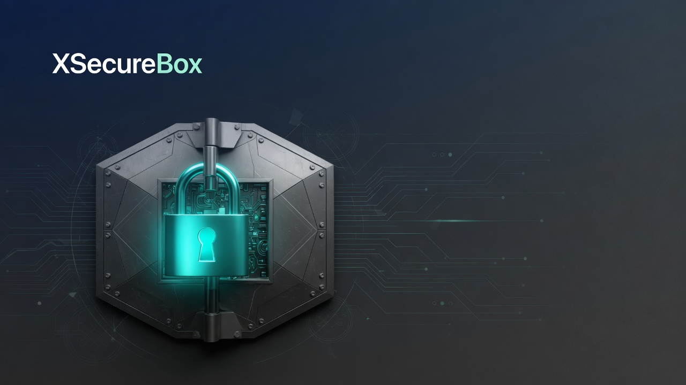

# XSecureBox — Open Source Self-Hosted Secrets Manager & Key Vault

[](LICENSE)
[](https://dotnet.microsoft.com/)
[](https://angular.dev/)
[](https://docs.docker.com/compose/)
[](https://github.com/yamaninko/xsecurebox)

<p align="center">
  
</p>

**XSecureBox** is a **self-hosted secrets manager** and **certificate-backed key vault**. Store API keys, passwords, certificates, and other secrets encrypted at rest. Run it on your own Docker host — no SaaS, no vendor lock-in.

**Keywords:** open source secrets manager · self-hosted key vault · certificate encryption · AES-256-GCM · TOTP MFA · Google Authenticator · private Ethereum · ASP.NET 9 · Angular · Docker Compose

[Quick start](#quick-start) · [Two-factor MFA](#two-factor-mfa-google-authenticator) · [Ethereum integrity](#private-ethereum-integrity-institutional-vms) · [Admin chain console](#admin-ethereum-console) · [Türkçe](#türkçe)

---

## What is XSecureBox?

XSecureBox is an **open-source alternative** for teams that want a **private vault** instead of a cloud password manager.

| You need | XSecureBox does |
|---|---|
| Store API keys and passwords encrypted | Yes — AES-256-GCM, DEK wrapped with an RSA certificate |
| Upload X.509 / PFX certificates | Yes |
| Retrieve a secret with an audit trail | Yes — password re-entry for people, scoped tokens for services |
| MFA and roles | Yes — TOTP + Google Authenticator QR + RBAC |
| Private Ethereum seal | Yes — hash on `SecureBoxRegistry`, verify before decrypt |
| Run it yourself | Yes — Docker Compose or Kubernetes |
| Hardware HSM / KMS | Not yet — your env KEK is the root of trust |

It is **not** a drop-in HashiCorp Vault clone. It is a smaller, full-stack vault: API + Angular portal + PostgreSQL + Redis + optional private ETH VM.

---

## Features

- **Envelope encryption** — random AES-256-GCM data key per secret, wrapped with RSA-OAEP (SHA-256) from your certificate
- **Certificate lifecycle** — upload PEM/PFX, revoke, expire (background sweep)
- **Key lifecycle** — create, list, retrieve, rotate, revoke, tags, environments (DEV/TEST/UAT/PROD)
- **Auth** — JWT access token in memory, **httpOnly refresh cookie**, login lockout, TOTP MFA
- **Google Authenticator setup** — portal shows a local QR code, store links, and a 6-digit confirm field (secret never leaves the browser to a third-party QR API)
- **Authorization** — Admin / Client / Service roles and permission policies; API clients use OAuth2 client-credentials + scopes (`keys:retrieve`)
- **Private Ethereum integrity** — each secret is sealed as `keccak256(ciphertext \|\| iv \|\| tag)` on `SecureBoxRegistry`; retrieve fails if the hash does not match
- **Admin Ethereum console** — live VM health, Solidity source, sealed keys, RPC/quorum/pause/owner, redeploy
- **Audit** — every create/retrieve/revoke written to PostgreSQL
- **Ops** — `/health/live`, `/health/ready`, rate limits, `scripts/backup.sh` / `restore.sh`
- **No default passwords in the repo** — Compose fails if `.env` is empty

---

## Quick start

**Requirements:** Docker Compose, OpenSSL.

```bash
git clone https://github.com/yamaninko/xsecurebox.git
cd xsecurebox
cp .env.example .env
```

Fill every value in `.env`:

```bash
openssl rand -base64 24   # POSTGRES_PASSWORD / REDIS_PASSWORD / ADMIN_PASSWORD
openssl rand -base64 48   # JWT_SECRET_KEY  (32+ characters)
# ENCRYPTION_KEK must be exactly 32 UTF-8 characters, or 32-byte base64
```

```bash
./scripts/start.sh
```

Open **https://localhost** (self-signed certificate — accept the browser warning).

| Surface | URL |
|---|---|
| Portal | https://localhost |
| API | https://localhost/api |
| Health | http://127.0.0.1:5002/health/live |
| Local ETH VM (Anvil) | http://127.0.0.1:8545 |
| Ethereum admin UI | https://localhost/chain |

First login: user `admin` and your `ADMIN_PASSWORD`. You must change the password, then enroll **Google Authenticator** on the MFA page (QR + 6-digit code). Admins then see **Ethereum** in the sidebar.

Rebuild after pulling: `./scripts/start.sh --build`

Stop: `./scripts/stop.sh`

---

## Two-factor MFA (Google Authenticator)

XSecureBox uses standard **TOTP** (6 digits, 30 seconds). Microsoft Authenticator and Authy accept the same QR.

1. Install [Google Authenticator](https://play.google.com/store/apps/details?id=com.google.android.apps.authenticator2) (or the [iOS app](https://apps.apple.com/app/google-authenticator/id388497605)).
2. Open the portal MFA page after first login.
3. Tap **+ → Scan a QR code**, or paste the setup key (time-based).
4. Enter the 6-digit code and click **Etkinleştir**.

The QR is generated **in the browser**. The secret is not sent to a public QR service.

---

## Private Ethereum integrity (institutional VMs)

XSecureBox can seal every secret on a **private Ethereum VM** you control. The chain never sees plaintext or the KEK — only:

- `keccak256(ciphertext || iv || tag)`
- algorithm id (`AES256-GCM+RSA-OAEP-SHA256`)
- this installation’s `systemId`

**Create / rotate** registers the hash in `SecureBoxRegistry`. **Retrieve** recomputes the hash and asks the ETH node(s) to confirm before decryption. **Revoke** marks the on-chain record revoked. Tampering with the database ciphertext fails verification.

Local Docker starts one Anvil node (`eth-1`, chain id `4242`). In the plant, add more dockerized geth/besu validators and list them as RPC URLs (env or the admin console). Set **Quorum** to how many must agree.

Contract: [`contracts/SecureBoxRegistry.sol`](contracts/SecureBoxRegistry.sol)

On-chain parameters you can change from the portal:

| Parameter | How |
|---|---|
| RPC URL list | Admin console → save |
| Quorum | Admin console → save |
| Require chain check on retrieve | Admin console → save |
| `paused` | Admin console (stops register/verify) |
| Contract `owner` | Admin console → new owner address |
| `systemId` | Immutable on a given deploy — use **Redeploy** |

Redeploy publishes a **new** registry. Old seals stay on the old address.

---

## Admin Ethereum console

Admins open **Ethereum** in the sidebar (`/chain`):

- Live VM health (reachable, block number, chain id)
- Contract address, `systemId`, owner, paused, deploy tx
- Full Solidity source
- Keys already sealed on chain
- Edit RPC / quorum / pause / owner, or attach an existing contract
- **Yeni kontrat yayınla** to deploy a fresh `SecureBoxRegistry`

API (admin JWT):

- `GET /api/v1/chain`
- `PUT /api/v1/chain/settings`
- `POST /api/v1/chain/redeploy`

---

## How encryption works

```
plaintext
   │
   ├─ random 256-bit DEK
   ├─ AES-256-GCM  →  ciphertext + IV + tag   (stored)
   └─ RSA-OAEP wrap(DEK, cert public key)     (stored)
```

The certificate **private key** is stored only if you upload a PFX/PEM with a key, encrypted with `ENCRYPTION_KEK`. Lose the KEK and you cannot decrypt existing secrets. Back the KEK up **separately** from the database.

---

## Security model

- Production (`ASPNETCORE_ENVIRONMENT=Production`) **refuses** known development JWT/KEK/admin values
- Refresh token is **not** returned in JSON — only an `sb_refresh` httpOnly cookie
- Retrieve requires the user's password (humans) or `keys:read` / `keys:retrieve` scope (API clients)
- Optional Ethereum quorum must confirm the ciphertext hash before decrypt
- Report vulnerabilities privately — see [SECURITY.md](SECURITY.md)

---

## Configuration

| Variable | Purpose |
|---|---|
| `POSTGRES_PASSWORD` | PostgreSQL password |
| `REDIS_PASSWORD` | Redis `requirepass` |
| `JWT_SECRET_KEY` | HMAC signing key, ≥ 32 characters |
| `ENCRYPTION_KEK` | 32-byte UTF-8 **or** 32-byte base64 |
| `ADMIN_PASSWORD` | Seeded admin password (must change on first login) |
| `ETHEREUM_PRIVATE_KEY` | Optional operator key (Anvil default is used locally only) |

---

## Tech stack

- **Backend:** ASP.NET 9, EF Core, PostgreSQL, Redis, JWT, BCrypt, Nethereum
- **Frontend:** Angular, Angular Material
- **Edge:** Nginx (TLS 1.2 / 1.3), Docker Compose
- **Integrity chain:** Foundry Anvil locally; any geth/besu RPC in production
- **Optional:** Kubernetes manifests under `kubernetes/`

---

## Tests

```bash
dotnet test src/backend/SecureBox.sln
```

---

## Documentation

- [API endpoints](docs/03-api-endpoints.md)
- [Database schema](docs/02-database-schema.md)
- [Security checklist](docs/08-security-checklist.md)
- [CI/CD](CI-CD-README.md)
- [Contributing](CONTRIBUTING.md)

---

## Who is this for?

- Teams that need a **self-hosted secrets manager** on their own VPS or lab
- Developers who want an **open source key vault** they can read and fork
- Operators who prefer PostgreSQL they already know over a black-box SaaS

---

## License

[MIT](LICENSE) — free to use, modify, and ship.

---

## Türkçe

**XSecureBox**, kendi sunucunuzda çalışan **açık kaynak secrets manager** ve **anahtar / sertifika kasası**dır. API anahtarları, parolalar ve sertifikalar AES-256-GCM ile şifrelenir; DEK, yüklediğiniz RSA sertifikasıyla sarılarak saklanır.

```bash
git clone https://github.com/yamaninko/xsecurebox.git
cd xsecurebox && cp .env.example .env   # değerleri doldurun
./scripts/start.sh
```

Portal: **https://localhost** — kullanıcı `admin`, şifre `.env` içindeki `ADMIN_PASSWORD`. İlk girişte Google Authenticator ile MFA kurulur. Admin menüsünde **Ethereum** ekranından çalışan VM’leri, kontrat kaynağını ve RPC/quorum/pause/owner parametrelerini yönetirsiniz.

Arama terimleri: açık kaynak secrets manager, self-hosted key vault, sertifika şifreleme, kendi sunucunda parola kasası, Docker secrets yönetimi, özel Ethereum doğrulama, Google Authenticator TOTP.
